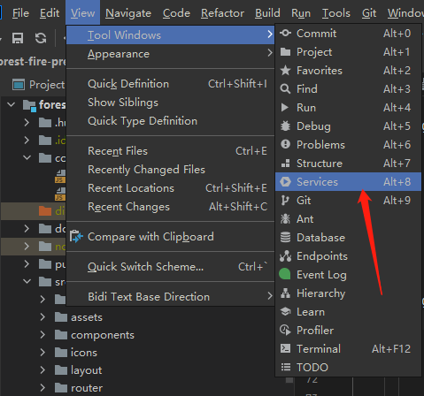
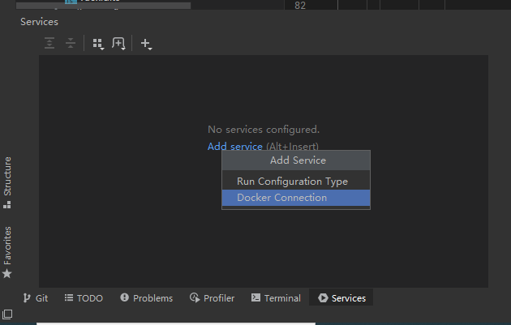
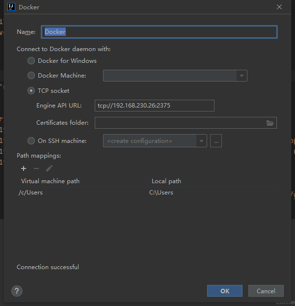
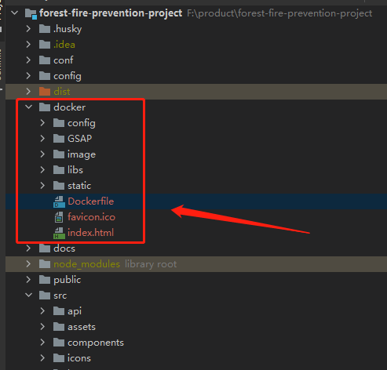
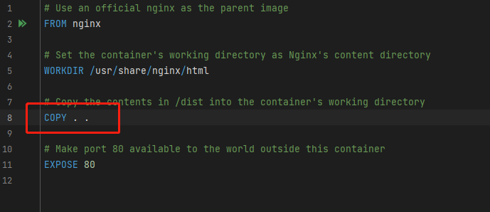
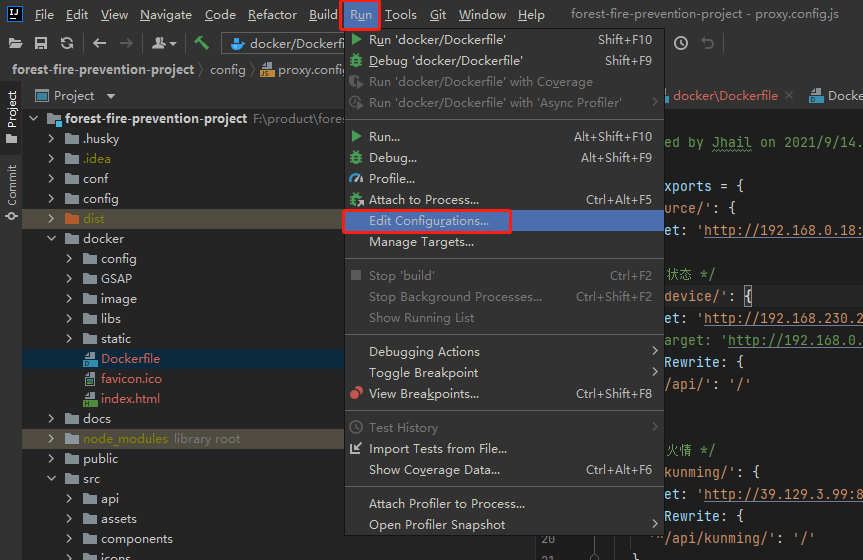
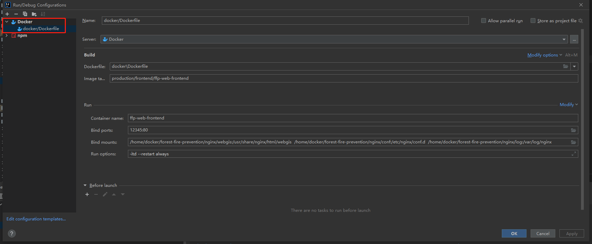
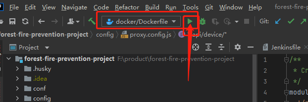
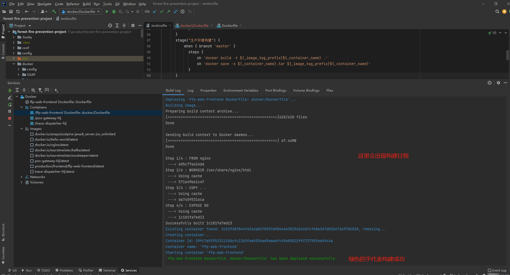

# 智慧森防的部署信息

## 开发环境服务器信息
- 服务器地址：192.168.0.18
- 用户名/密码：root/root

## 开发环境docker信息
此项目使用docker进行部署。
- 镜像名称：production/frontend/ffp-web-frontend
- 容器名称：ffp-web-frontend
- 挂载卷信息可参考创建容器时执行的命令(详查项目根目录下的Jenkinsfile文件)：
```shell
docker run -itd -p ${_project_port}:80 \
--name ${_container_name} \
--restart always \
-v /home/docker/${_project_name}/nginx/webgis:/usr/share/nginx/html/webgis \
-v /home/docker/${_project_name}/nginx/conf:/etc/nginx/conf.d \
-v /home/docker/${_project_name}/nginx/log:/var/log/nginx \
${_image_tag_prefix}${_container_name}
```

## nginx配置信息
nginx配置文件的位置：/home/docker/forest-fire-prevention/nginx/conf/default.conf
gis需要的资源部署位置：/home/docker/forest-fire-prevention/nginx/webgis/
nginx配置文件的内容为(有的配置项可能暂时不在用)：
```text
server {
    listen       80;
    listen  [::]:80;
    server_name  localhost;

    #charset koi8-r;
    #access_log  /var/log/nginx/host.access.log  main;
    absolute_redirect off;

    location / {
        root   /usr/share/nginx/html;
        try_files $uri $uri/ /index.html;
        index  index.html index.htm;
    }
    location /resource/ { # gis模块需要的资源
        alias /usr/share/nginx/html/webgis/;
    }

    location /api/device/ { # 设备上下线模块的接口
        proxy_pass http://192.168.0.15:18082/device/;
    }

    location /api/kunming/ { # 调用昆明项目中的昆明火情接口
        proxy_pass http://39.129.3.99:8001/;
    }

    location /UpLoadFiles/ { # 昆明火情图片
        proxy_pass http://39.129.3.99:8001;
    }

    location /api/api/ { # 昆明气象信息查询的接口
        proxy_pass http://39.129.3.99:8006/api/;
    }

    location /wms/ { // gis需要获取的资源路径
        proxy_pass http://39.129.3.99:8010;
    }

    location /api/v1/ {  # 视频监控平台（LiveGBS）对应的接口
        proxy_pass http://39.129.3.99:8011;
    }
    location /sms/ { # 视频监控平台对应的接口
        proxy_pass http://39.129.3.99:8011;
    }
    
    location /api/ys/ { # 大数据统计模块对应的接口
        proxy_pass http://192.168.0.40:8000/ys/;
    }

    location @router {
	    rewrite ^.*$ /index.html last;
    }


    #error_page  404              /404.html;

    # redirect server error pages to the static page /50x.html
    #
    error_page   500 502 503 504  /50x.html;
    location = /50x.html {
        root   /usr/share/nginx/html;
    }
}
```

## 黑龙江环境部署教程

因为12环境的Jenkins无法访问黑龙江环境，所以需要在本地环境手动构建部署。使用Intellij Idea进行如下操作：

> 切记要先打开vpn~

1. 先安装IDEA的插件：Docker,再找到Services视图

   

2. Docker Connection

   

3. 输入配置，如下图

   

4. 先运行build命令打包前端代码到dist目录。然后可以新建个目录（比如docker），把dist目录中的打包后的文件和根目录的Dockerfile文件拷贝到docker目录。（Dockerfile文件拷贝到docker文件夹后，记得改下内容，参考下面图片为修改内容后的！）
   

   
   
5. 在IDEA中的run菜单中找到 **Edit Configurations**,按如下图配置：

   

   

6. 配置完成后，运行：

   

7. 查看Services面板：

   

>镜像名称：production/frontend/ffp-web-frontend  
>容器名称：ffp-web-frontend  
>nginx配置路径：/home/docker/forest-fire-prevention/nginx/conf  
>服务访问地址：http://192.168.230.26:12345  
>
>不要忘记打开vpn

