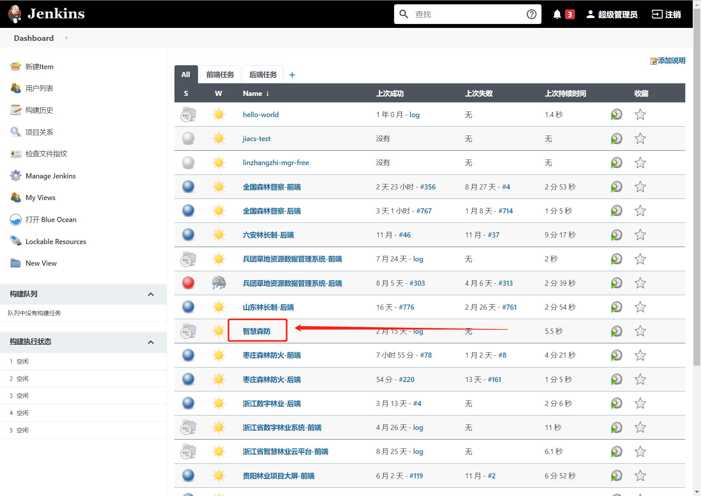
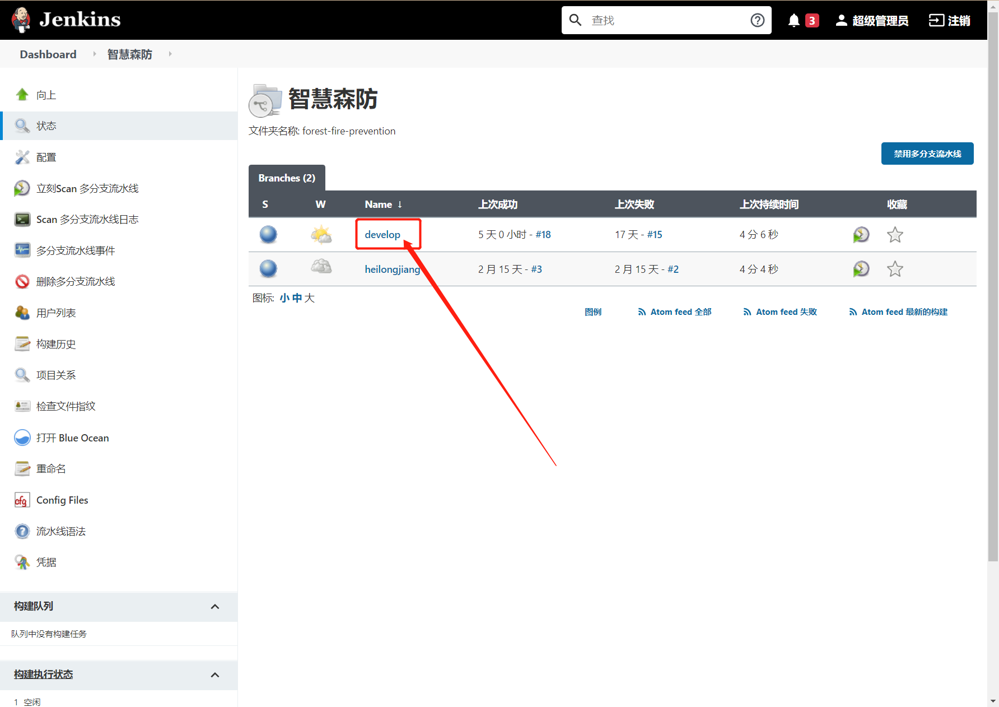
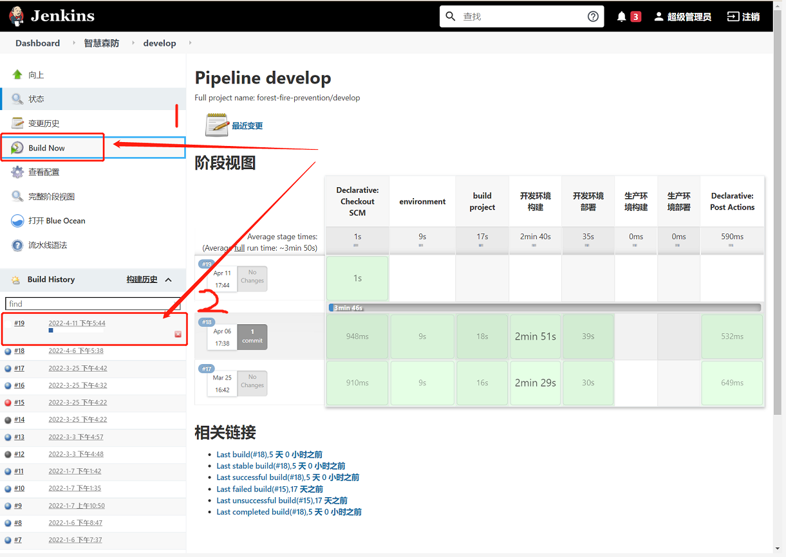

# 持续集成部分的简介

## 基本信息
- 服务地址：http://192.168.0.12:8080/login
- 用户名/密码： admin/1234567890 &nbsp;&nbsp;&nbsp;&nbsp;  Frontend/Otitan@Frontend

## 操作流程
1. 登录系统，找到智慧森防任务，点击进入：
  
2. 点击进入需要构建的分支，比如需要构建devops分支：
  
3. 点击位置1处的 **Build Now**,稍后会发现位置2处会显示当前正在构建的任务。
  
4. 构建完成后会将构建结果发送至钉钉群中。