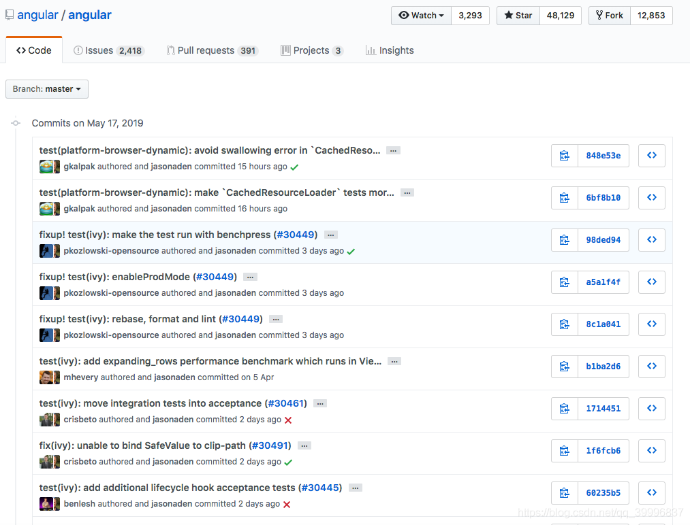
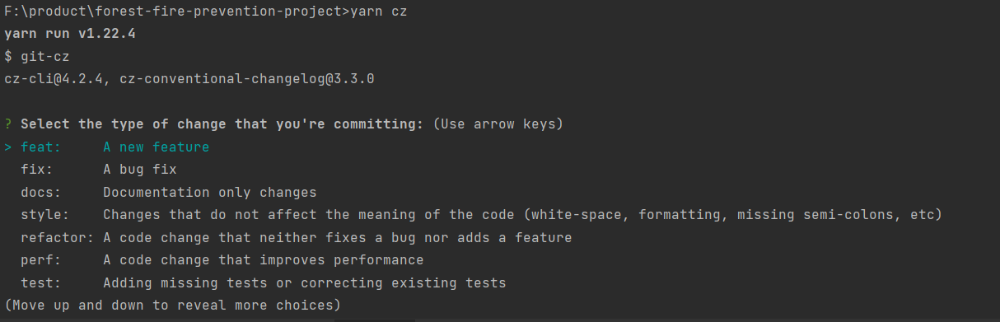
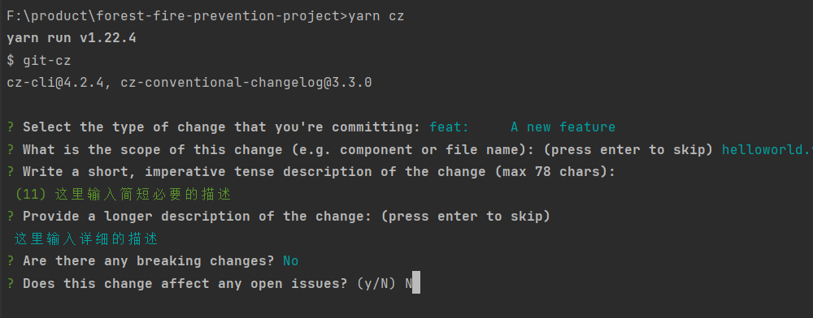

# Git 提交规范

### 一、为什么需要制定提交规范？

在团队协作开发时，每个人提交代码时都会写 commit message。每个人都有自己的书写风格，可以说是五花八门，十分不利于阅读和维护。一般来说，大厂都有一套的自己的提交规范，尤其是在一些大型开源项目中，commit message 都是十分一致的。因此，我们需要制定统一标准，促使团队形成一致的代码提交风格，更好的提高工作效率，成为一名有追求的工程师。

### 二、采用哪种规范？

采用Angular的git commit 规范，基本项目都在采用这套规范。

### 三、提交记录概览


### 四、规范具体介绍

Commit Message 格式:每次提交，Commit message 都包括三个部分：Header，Body 和 Footer。

```
<type>(<scope>): <subject>

<空行>

<body>

<空行>

<footer>
```

其中，Header 是必需的，Body 和 Footer 可以省略。

**Header:** Header部分只有一行，包括三个字段：type（必需）、scope（可选）和subject（必需）。

  1. type:

    >  feat：新增功能；  
    >  fix：修复bug；  
    >  docs：修改文档；  
    >  refactor：代码重构，未新增任何功能和修复任何bug；  
    >  build：改变构建流程，新增依赖库、工具等（例如webpack修改）；  
    >  style：仅仅修改了空格、缩进等，不改变代码逻辑；  
    >  perf：改善性能和体现的修改；  
    >  chore：非src和test的修改；  
    >  test：测试用例的修改；  
    >  ci：自动化流程配置修改；  
    >  revert：回滚到上一个版本；

  2. scope:  用于说明 commit 影响的范围，比如数据层、控制层、视图层、包名、文件名等等。

  3. subject: 是 commit 目的的简短描述，不超过50个字符，结尾不加句号。

**Body:** 对本次 commit 的详细描述,应该说明代码变动的动机，以及与以前行为的对比。

**Footer:** （Footer有两种情况）

  1. 是否有重大的改变(是否有突破性的变化)

  框架式改变，或者跟上一版本不兼容，则 Footer 部分以BREAKING CHANGE开头，后面是对变动的描述、以及变动理由和迁移方法。

  2. 这一变化是否影响到任何尚未解决的问题(关闭issue)

  可以填写fix #1 等于关闭问题1 或者 使用Closes #1,关闭多个issue使用fix #1,#2,#3 逗号分割，关闭了三个issue。

### 五、 用工具协助和约束团队
  > 注： 以下工具只针对前端项目。

  1. [commitizen](https://www.npmjs.com/package/commitizen): 

  - 全局安装：(全局安装仅是在个人的电脑上配置了环境，不能保证所有团队成员的环境一致，不推荐)
    ```
    npm install -g commitizen
    ```
  
  - 安装在项目的`devDependencies`依赖下：（推荐，在安装项目依赖时自动安装，可以减少团队成员的心智负担）
    ```
    npm install commitizen -D
    ```
    并配置`npm script`
    ```
    ...
    "scripts": {
      "commit": "cz"
    }
    ```
    然后在项目下执行(项目使用`Npm`的话)
    ```
    commitizen init cz-conventional-changelog --save-dev --save-exact
    ```
    或者项目使用`Yarn`时:
    ```
    commitizen init cz-conventional-changelog --yarn --dev --exact
    ```
    在`package.json`中配置：（此配置可以方便后期生成changelog）
    ```
    ...
    "config": {
      "commitizen": {
        "path": "cz-conventional-changelog"
      }
    }
    ```
    与changelog相关的功能也可配合工具包[conventional-changelog](https://www.npmjs.com/package/conventional-changelog)使用。
  - git-cz
    之前使用git commit提交信息，现在使用`npm run cz`或`yarn cz`命令：
    
    选择一个type，并根据提示一次操作:
    

  2. [@commitlint/cli](https://www.npmjs.com/package/@commitlint/cli)

    `@commitlint/cli`可以检查提交信息是否符合规范。  
    单纯的使用`commitizen`不足以完全约束团队的`commit`信息。因为提交的命令不再是`git commit`了，
    如果某个成员疏忽忘记时习惯性的使用`git commit`提交的话，即使提交信息不符合规范也依然可以提交成功。
    所以需要配合`@commitlint/cli`，来检查`commit`信息，当提交信息不合格时，则中断提交动作。
    但是`@commitlint/cli`只检测提交信息是否规范，没法在提交时自动执行，所以还要引入另外一个工具: `husky`。
  3. [husky](https://www.npmjs.com/package/husky)

    我们的需求是在提交时自动检测提交信息，需要在git hooks中进行检测动作，而`husky`正是注册git hooks执行动作的工具。


<br/>
<br/>
<br/>
<br/>

> 改变的秘密，是把所有的精力放在建造新的东西上，而非与过去抗衡。